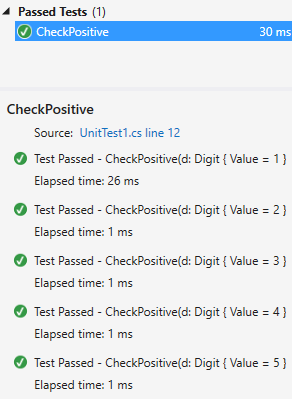

Xunit.SerializedTheoryData
======================

This project provides a simple replacement for TheoryData that automatically serializes and deserializes in order to show more fidelity in test cases. Normally when using custom classes (POCOs) as parameters with Xunit theories Visual Studio will show multiple test cases in one item in the Test Explorer, unless those classes implement IXunitSeralizable. This simply wrapper automatically does that for you, and as long as the classes are serializable and deserializable with [Json.NET](http://www.newtonsoft.com/json), Visual Studio Test Explorer will break out individual test cases.

Currently only classes, and lists are supported.

[](https://nuget.org/packages/xunit.serializedtheorydata)

## Installation

This project is available as a [NuGet package][NuPkg]

## Example

Suppose you have this simple class in your project:

```csharp
public class Digit
{
	public int Value { get; set; }
}
```

This class could be in a class library where implementing IXunitSerializable is inconvenient, or you might just not want to bother for such a simple class.

Right now if you write the following simple Theory, Visual Studio displays your tests as shown:

```csharp
[Theory]
[MemberData("GetTestCases")]
public void CheckPositive(Digit d)
{
	Assert.True(d.Value > 0);
}

public static TheoryData<Digit> GetTestCases()
{
	return new TheoryData<Digit>
	{
		{ new Digit() { Value = 1 } },
		{ new Digit() { Value = 2 } },
		{ new Digit() { Value = 3 } },
		{ new Digit() { Value = 4 } },
		{ new Digit() { Value = 5 } }
	};
}
```

Visual Studio will display the test like this:


All of the test cases ran, but only one is shown in the Test Explorer. By simply changing `TheoryData` to `SerializedTheoryData` our code and Visual Studio now look like this:

```csharp
[Theory]
[MemberData("GetTestCases")]
public void CheckPositive(Digit d)
{
	Assert.True(d.Value > 0);
}

public static SerializedTheoryData<Digit> GetTestCases()
{
	return new SerializedTheoryData<Digit>
	{
		{ new Digit() { Value = 1 } },
		{ new Digit() { Value = 2 } },
		{ new Digit() { Value = 3 } },
		{ new Digit() { Value = 4 } },
		{ new Digit() { Value = 5 } }
	};
}
```


 [NuPkg]: https://www.nuget.org/packages/Xunit.SerializedTheoryData