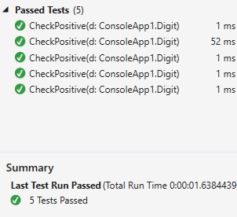

Xunit.SerializedTheoryData
======================

This project provides a simple replacement for TheoryData that automatically serializes and deserializes in order to show more fidelity in test cases. Normally when using custom classes (POCOs) as parameters with Xunit theories Visual Studio will show multiple test cases in one item in the Test Explorer, unless those classes implement IXunitSeralizable. This simple wrapper automatically does that for you, and as long as the classes are serializable and deserializable with [Json.NET](http://www.newtonsoft.com/json), Visual Studio Test Explorer will break out individual test cases.

Currently only classes, and lists are supported.

[](https://ci.appveyor.com/project/StarRez/xunit-serializedtheorydata)
[](https://nuget.org/packages/xunit.serializedtheorydata)

## Installation

This project is available as a [NuGet package][NuPkg]

## Example

Suppose we have this simple class in a project somewhere:

```csharp
public class Digit
{
	public int Value { get; set; }
}
```

This class could be in a class library where taking a dependency on Xunit and implementing IXunitSerializable is inconvenient, or we might just not want to bother for such a simple class.

Right now if we write the following simple Theory, Visual Studio displays the tests as shown:

```csharp
[Theory]
[MemberData("GetTestCases")]
public void CheckPositive(Digit d)
{
	Assert.True(d.Value > 0);
}

public static TheoryData<Digit> GetTestCases()
{
	return new TheoryData<Digit>
	{
		{ new Digit() { Value = 1 } },
		{ new Digit() { Value = 2 } },
		{ new Digit() { Value = 3 } },
		{ new Digit() { Value = 4 } },
		{ new Digit() { Value = 5 } }
	};
}
```


All of the test cases ran, but only one is shown in the Test Explorer. By simply changing `TheoryData` to `SerializedTheoryData`, and changing our test to take a `SerializedWrapper<Digit>` our code and Visual Studio now looks like this:

```csharp
[Theory]
[MemberData("GetTestCases")]
public void CheckPositive(SerializedWrapper<Digit> d)
{
	Assert.True(d.Object.Value > 0);
}

public static SerializedTheoryData<Digit> GetTestCases()
{
	return new SerializedTheoryData<Digit>
	{
		{ new Digit() { Value = 1 } },
		{ new Digit() { Value = 2 } },
		{ new Digit() { Value = 3 } },
		{ new Digit() { Value = 4 } },
		{ new Digit() { Value = 5 } }
	};
}
```



Changing the parameter is not ideal but unfortunately things like implicit casts don't work when Xunit invokes the test method. The advantage is still there, in that the `Digit` class remains unchanged and is not muddied with test-supporting code. We also didn't have to change our test case generation code as the wrapping is automatic.

### Lists

As an extra helper if our test parameter is a `List<T>` then there is no need to change the parameter specification at all, so for the following example, multiple test cases are displayed as is, simply by using `SerializedTheoryData` instead of `TheoryData`.

```csharp
[Theory]
[MemberData("GetTestCases")]
public void CheckAllPositive(List<Digit> digits)
{
	Assert.True(digits.TrueForAll(d => d.Value > 0));
}

public static SerializedTheoryData<List<Digit>> GetTestCases()
{
	return new SerializedTheoryData<List<Digit>>
	{
		new List<Digit>
		{
			{ new Digit() { Value = 1 } },
			{ new Digit() { Value = 2 } }
		},
		new List<Digit>
		{
			{ new Digit() { Value = 3 } },
			{ new Digit() { Value = 4 } }
		},
		new List<Digit>
		{
			{ new Digit() { Value = 5 } },
			{ new Digit() { Value = 6 } }
		}
	};
}
```

Lists and normal class parameters can be intermingled as required.

 [NuPkg]: https://www.nuget.org/packages/Xunit.SerializedTheoryData